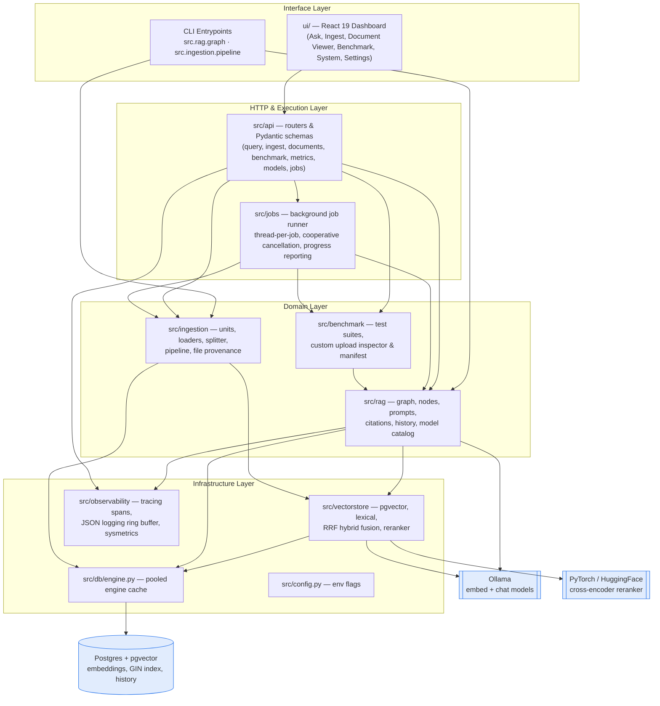
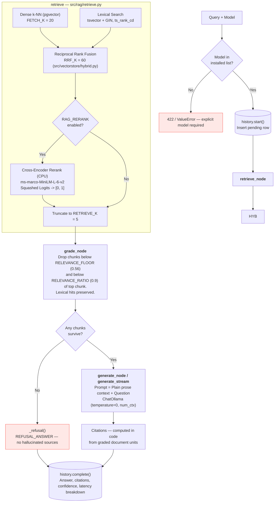
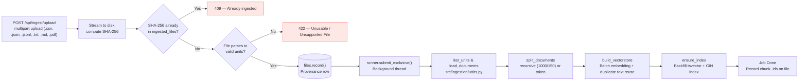

# Architecture

A local-only retrieval-augmented generation system. Nothing leaves the machine: Postgres (pgvector) stores the chunks, embeddings, and full-text search indexes; Ollama serves both the embedding model and the chat model; a Cross-Encoder provides precision reranking; and a FastAPI service coordinates them behind a React dashboard.

---

## 1. Why it runs entirely locally

Every component — the LLM, the embedding model, the cross-encoder reranker, and the vector database — runs on the host machine. No document text and no query ever leaves the host, there is no per-token cost, and the entire stack boots with `docker compose up`.

The tradeoff is compute and memory management: small models like `llama3.2:3b` and `qwen2.5:3b` are chosen to operate. Swapping to a hosted API later requires changing only the `ChatOllama` LLM client adapter.

---

## 2. The Pieces

- **Ollama:** Serves local models over HTTP: chat generation (`llama3.2:3b`, `qwen2.5:3b`, `gemma2:2b`, `phi3.5`) and text embeddings (`nomic-embed-text`, 768 dimensions).
- **Postgres + pgvector:** Stores document chunks, relational metadata, and embeddings for vector similarity queries. Also maintains a generated stored `tsvector` column and GIN index for lexical search.
- **Cross-Encoder Reranker:** Hugging Face `cross-encoder/ms-marco-MiniLM-L-6-v2` running on CPU via `sentence_transformers` to rerank fused candidate passages without consuming GPU VRAM.
- **LangChain & LangGraph:** LangChain supplies adapters (`OllamaEmbeddings`, `PGVector`, text splitters, loaders). LangGraph orchestrates the state machine workflow (`retrieve` → `grade` → `generate` → `END`).
- **Background Job Runner:** In-process threaded registry for long-running ingestion, benchmark evaluation, and model downloads with cooperative cancellation.

---

## 3. The Four Layers

**The rule that keeps this honest:** dependencies only point downward.

---

## 4. Answering a Query

`ask()`, `ask_stream()`, and `ask_compare()` in `src/rag/graph.py` execute through the LangGraph workflow:

### Key Query-Path Invariants:
1. **No Retry Loop:** Retrieval is deterministic. Without query rewriting, looping on identical inputs cannot surface new chunks that cleared cutoffs the top results missed.
2. **Deterministic Attribution:** Citations (`src/rag/citations.py`) are extracted from surviving graded chunks, mapping directly to `(file_id, unit_index)`. Small models are never asked to generate inline citations.
3. **Retrieval Impact Comparison:** `ask_compare()` and `ask_direct()` execute grounded vs direct LLM generation side-by-side without writing ad-hoc test queries to query history.

---

## 5. Ingesting Documents

### Key Ingest-Path Invariants:
1. **Addressable Units (`src/ingestion/units.py`):** Files are indexed by natural physical units: spreadsheet rows (1-based), document lines (1-based), or PDF pages (1-based). Dataset keys and Dropbox/source URLs are lifted into metadata and excluded from embedding text to preserve token budget.
2. **Text Deduplication:** Duplicate chunk text across rows is vectorized only once by Ollama; the embedding vector is mapped to all duplicate instances before inserting into pgvector.
3. **Fault-Tolerant Batching:** Embeddings are dispatched in batches (`RAG_EMBED_BATCH=512`/`1024`) and written incrementally to Postgres. If Ollama crashes on an oversized chunk, divide-and-conquer recursion isolates the failure.
4. **Embedding Model Pinning:** The active embedding model (`RAG_EMBED_MODEL=nomic-embed-text`) is pinned per collection. Changing embedding models requires re-ingesting the corpus.

---

## 6. Document Viewer & Unit Inspector

The system provides first-class inspection of ingested documents via `src/api/routes/documents.py`:
- `GET /api/documents/{file_id}`: Retrieves document metadata, unit counts, and CSV column headers.
- `GET /api/documents/{file_id}/units`: Slices addressable document units with pagination.
- `GET /api/documents/{file_id}/units/{index}`: Resolves the exact addressable unit referenced by a citation pill.
- The UI exposes both an inline modal (`DocumentModal.jsx`) and a standalone route (`/documents/:fileId`).

---

## 7. System Telemetry & Configuration Lifetimes

System metrics are collected server-side (`src/observability/sysmetrics.py`) using `psutil`, `pynvml`, and Docker statistics, and pushed over a 1Hz Server-Sent Events stream (`GET /api/metrics/stream`).

### Configuration Lifetimes

| Lifetime | Examples | Changing it means |
|---|---|---|
| **Baked into the index** | Chunk size, chunk overlap, embedding model (`RAG_EMBED_MODEL`) | Re-ingesting the corpus |
| **Live per query** | Chat model (`model`), candidate fetch count (`RAG_FETCH_K`), relevance floor/ratio, reranker toggle (`RAG_RERANK`) | Takes effect on the next query |
| **Server-owned** | `DATABASE_URL`, `OLLAMA_BASE_URL`, `RAG_NUM_CTX` | Server restart; never exposed to browser |

---

## 8. Where New Code Goes

| You are adding… | It belongs in |
|---|---|
| A new document format parser | `src/ingestion/units.py` (and register in `_READERS`) |
| A new chunking algorithm | `src/ingestion/splitter.py` (and register in `SPLITTERS`) |
| A new retrieval or ranking signal | `src/vectorstore/`, fused in `hybrid.py` or `rerank.py` |
| A retrieval/grading/generation node | `src/rag/retrieve.py`, `src/rag/grade.py`, or `src/rag/generate.py` |
| Model registry or thinking suppression | `src/rag/models.py`, `src/rag/thinking.py`, or `src/rag/model_policy.py` |
| A prompt template or generation filter | `src/rag/prompts.py` or `src/rag/nodes.py` (facade) |
| A new API route or schema | `src/api/routes/` and `src/api/schemas.py` |
| A new background task | `src/jobs/runner.py`, submitted via `runner.submit` or `runner.submit_exclusive` |
| A benchmark evaluation runner or tool | `src/benchmark/runner.py`, `src/benchmark/cache.py`, `src/benchmark/files.py` |
| A database query or schema change | `src/db/engine.py`, `src/rag/history.py`, or `src/ingestion/files.py` |
| A new dashboard screen or component | `ui/src/views/` and `ui/src/components/`, routed lazily in `ui/src/App.jsx` |
