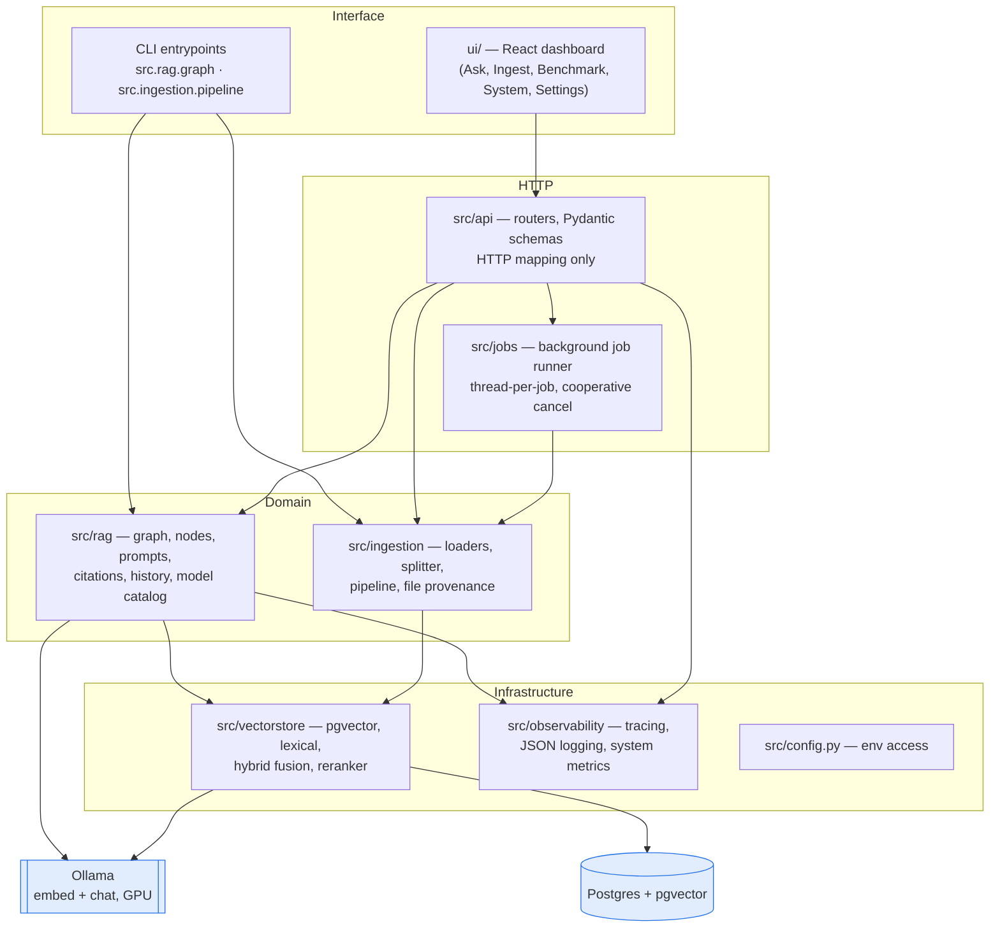
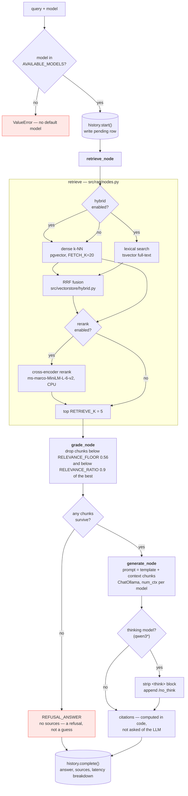
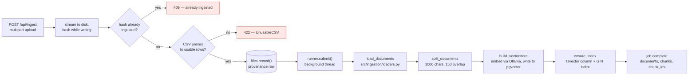

# Architecture

A local-only retrieval-augmented generation system. Nothing leaves the machine: Postgres (pgvector) stores the chunks and their embeddings, Ollama serves both the embedding model and the chat model, and a FastAPI service wires them together behind a React dashboard.

## 1. Why it runs entirely locally

Every component — the LLM, the embedding model, the vector database — runs in a container on this machine. No document text and no query ever leaves the host, there is no per-token cost, and the whole stack comes up with one `docker compose up`.

The tradeoff is quality and speed: `llama3.2:3b` is a small model chosen to fit inside the 4GB of VRAM on a GTX 1050. Swapping to a hosted API later means changing one `ChatOllama(...)` construction.

## 2. The Pieces

- **Ollama:** Serves two models over HTTP: `llama3.2:3b` generates answers, and `nomic-embed-text` turns text into vectors. Uses GPU passthrough.
- **Postgres + pgvector:** Stores document chunks alongside vectors and answers nearest-neighbour queries. Also holds a `tsvector` column + GIN index for lexical search.
- **LangChain & LangGraph:** LangChain supplies the adapters (OllamaEmbeddings, PGVector, loaders). LangGraph orchestrates control flow as an explicit state graph (retrieve → grade → generate).

## 3. The Four Layers

**The rule that keeps this honest:** arrows only point downward.

## 4. Answering a Query

`ask()` and `ask_stream()` in `src/rag/graph.py` walk three nodes.

- **There is no retry edge:** Retrieval is deterministic; re-running the same query returns the same results.
- **Citations are computed, not generated:** Small models don't reliably follow inline-citation rules, so `src/rag/citations.py` deterministically attributes sources from graded chunks.

## 5. Ingesting Documents

**Invariant:** The embedding model used at ingest must match the one used at query time. A mismatch silently returns garbage neighbours.

## 6. UI Architecture and Metrics

The UI is built with React/Vite and talks to the FastAPI backend. It provides views for Ask, Ingest, Benchmark, System, etc.

Since browsers don't expose host system metrics (CPU load, VRAM, GPU temps), these are collected server-side (`src/observability/sysmetrics.py`) using `psutil`, `pynvml`, and Docker APIs, and streamed via Server-Sent Events (SSE).

### Configuration Lifetimes

| Lifetime | Examples | Changing it means |
|---|---|---|
| **Baked into the index** | chunk size, overlap, embedding model | Re-ingesting the entire corpus |
| **Live per query** | `k`, relevance cutoffs, chat model | Takes effect on the next query |
| **Server-owned** | `DATABASE_URL`, `OLLAMA_BASE_URL` | Restart; never exposed to browser |

## 7. Where New Code Goes

| You are adding… | It belongs in |
|---|---|
| A new document format | `src/ingestion/loaders.py` |
| A new chunking strategy | `src/ingestion/splitter.py` (register it in `SPLITTERS`) |
| A new retrieval signal | `src/vectorstore/`, fused in `hybrid.py` |
| A change to how answers are produced | `src/rag/nodes.py` + `src/rag/prompts.py` |
| A new endpoint | A router in `src/api/routes/`, schemas in `src/api/schemas.py` |
| Anything long-running | A job kind on `src/jobs/runner.py`, never inline in a route |
| A new dashboard screen | `ui/src/views/`, wired into `ui/src/App.jsx` |
