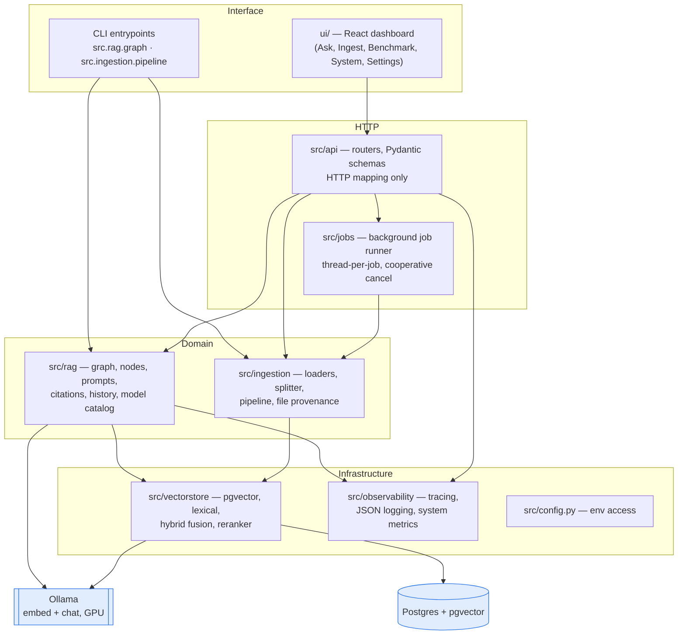
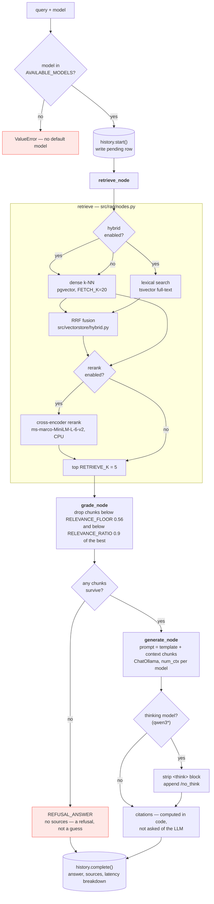
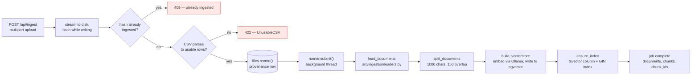

# Architecture

A local-only retrieval-augmented generation system. Nothing leaves the machine: Postgres
(pgvector) stores the chunks and their embeddings, Ollama serves both the embedding model and
the chat model, and a FastAPI service wires them together behind a React dashboard.

This document is the map. It explains what each layer owns, how a query and an ingest actually
flow through the code, and where to put new code so it lands in the right place.

---

## 1. The four layers

**The rule that keeps this honest: arrows only point downward.** `src/vectorstore` must never
import `src/rag`; `src/rag` must never import `src/api`. If you need something from a layer
above, the dependency is inverted — pass it in as an argument.

---

## 2. Answering a query

`ask()` and `ask_stream()` in `src/rag/graph.py` are the two entrypoints. Both walk the same
three nodes; the streaming one steps them by hand so it can emit stage boundaries and tokens.

Two design decisions worth knowing before you change anything here:

- **There is no retry edge.** Retrieval is deterministic and returns results sorted by
  descending similarity, so re-running the same query can never surface a chunk that clears
  the grader when the top results did not. A retry loop only becomes useful alongside query
  rewriting.
- **Citations are computed, not generated.** Small local models do not reliably follow
  inline-citation instructions, so `src/rag/citations.py` derives sources deterministically
  from the chunks that survived grading.

---

## 3. Ingesting documents

**The invariant that matters most: the embedding model used at ingest must match the one used
at query time.** A mismatch does not raise — it silently returns garbage neighbours. Treat the
embedding model as baked into the index, not as a runtime setting.

---

## 4. Configuration lifetimes

Not all configuration is the same kind of thing, and conflating the three is the most common
source of confusion in this codebase.

| Lifetime | Examples | Changing it means |
|---|---|---|
| **Baked into the index** | chunk size, chunk overlap, embedding model | Re-ingesting the entire corpus |
| **Live per query** | `k`, relevance floor/ratio, chat model, citations on/off | Takes effect on the next query |
| **Server-owned** | `DATABASE_URL`, `OLLAMA_BASE_URL` | Restart; never exposed to the browser |

---

## 5. Where new code goes

| You are adding… | It belongs in |
|---|---|
| A new document format | `src/ingestion/loaders.py` |
| A new chunking strategy | `src/ingestion/splitter.py` (register it in `SPLITTERS`) |
| A new retrieval signal | `src/vectorstore/`, fused in `hybrid.py` |
| A change to how answers are produced | `src/rag/nodes.py` + `src/rag/prompts.py` |
| A new endpoint | A router in `src/api/routes/`, schemas in `src/api/schemas.py` |
| Anything long-running | A job kind on `src/jobs/runner.py`, never inline in a route |
| A new dashboard screen | `ui/src/views/`, wired into `ui/src/App.jsx` |

A route function should read as HTTP mapping and nothing else: parse, call one domain function,
translate errors to status codes. When a route body starts orchestrating storage, the logic has
escaped its layer.
